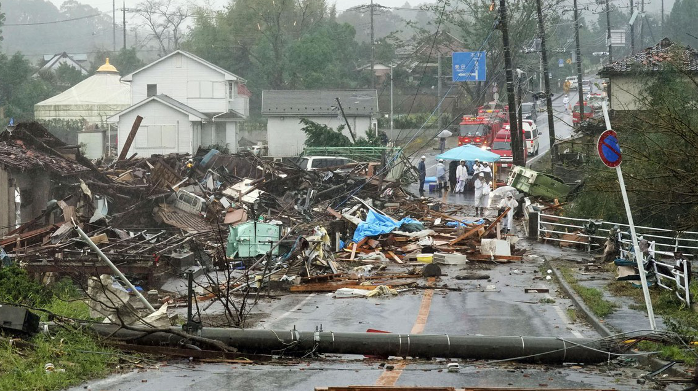
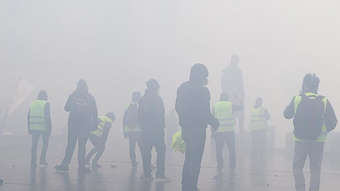

 

# Overview

 {width=99%}
  **Natural Catastrophes and Economic Growth**

 How can we integrate climatic and extreme weather events into models of economic growth? How can economists use the tools from climate impact assessment in synergy with economic models? Do economies adapt to flood risk?

 {width=99%}
  **Carbon Tax**

 How does the announcement of a carbon tax affect agents' behavior in the economy? What are the welfare consequences when the economy anticipates a carbon tax? How does the stringency of the tax matter in all this?

  

# Working papers

- *"Economic Growth and Equity in Anticipation of Climate Policy"* (with A. Miftakhova)

 

# Work in progress

- *"Climate Impact Assessments and Economic Growth: the Case of Tropical Cyclones"* (with J. Lehtomaa, draft available upon request)
- *"Misfortunes Never Come Singly: Environmental Risks and Economis Growth"* (with A. Brausmann and L. Bretschger)
- *"Evidence of Global Adaptation to Flood Risk?"*

 

# Non-peer-reviewed publications

- A. Stünzi, A. Schaefer, A. Miftakhova, C. Renoir, L. Bretschger (2021) *"Expectation formation in energy markets and its impact on the success of future energy policies"*, Swiss Federal Office of Energy SFOE Energy Research and Cleantech